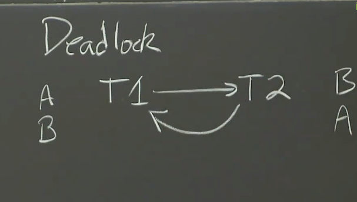

#  RPC与多线程

这门课上我们之所以这么关心线程，是因为线程是我们用来管理程序中并发的主要工具

### I/O Concurrency
在我们这里。我们常讲的并发I/O是指，假设有一个已经启动的程序，在同一时间内，他可以通过RPC来对网络的不同服务器进行请求，并同时等待许多回复

### Parallelism
可以让程序并行执行，但这不是分布式系统的关键

### Convenience

我们可以后台开一个循环从而实现 心跳机制


## 其他的选择

我们还可以使用`异步编程` 或者又叫`事件爱你驱动编程` 来实现相同的目的
事件驱动编程的基本结构就是，他通常有一个线程和一个循环，这个循环所做的事就是等待可能会和触发的任何输入或者任何事件发生。所以，这个事件可能是收到了来自某个客户端的请求，或者定时器所定的时间到了

在这种事件循环型程序中，你会通过一个循环中的线程来等待接收输入，当他得到一个输入时，例如数据包，他会去弄清楚是那个客户端发送的，它会有一张表格，用来管理该客户端的活动，或者该客户端处于什么样的状态


这种事件驱动模式的一个问题在于，写起代码来有点痛苦，另一种潜在缺陷是，当你使用这种策略来进行并发IO时，无法使用CPU的并行能力

## 使用多线程进行编程

### Race
我们知道一个进程中的多线程之间是共享地址空间的，这很方便但是也很容易出错。这种危机通常被称为 race，我要说的是，你会做很多针对共享状态进行争夺的多线程编程(就是我们常说的正对volatile变量的CAS操作)

对于我们来说，之所以会将之称为一个race,是因为如果众多cpu中的一个已经开始执行了这段代码，其他线程想要执行这段代码，那就要等第一个处理器处理结束后才能进行一个race(即进行一波cas争抢执行权的操作，以保证我们对数据操作的原子性) —— `加锁`

``` go
mu.Lock()
// TODO
mu.Unlock()
```

> 在数据结构中隐藏一个锁并不总是一个好主意

### Coordination

当我们执行所操作的时候，涉及的不同线程可能不知道彼此状态，对于另外一些线程，它们只希望能够获取数据而不会受到其他线程的干扰

- `channel`
- `sunc.Cond`
- `watiGroup`

### Deadlock




``` go
package main

import (
	"fmt"
	"sync"
)

type Fetcher interface {
	// Fetch returns the body of URL and
	// a slice of URLs found on that page.
	Fetch(url string) (body string, urls []string, err error)
}

// Crawl uses fetcher to recursively crawl
// pages starting with url, to a maximum of depth.
func Crawl(url string, depth int, fetcher Fetcher) {
	// TODO: Fetch URLs in parallel.
	// TODO: Don't fetch the same URL twice.
	// This implementation doesn't do either:
	if depth <= 0 {
		return
	}
	body, urls, err := fetcher.Fetch(url)
	if err != nil {
		fmt.Println(err)
		return
	}
	fmt.Printf("found: %s %q\n", url, body)
	for _, u := range urls {
		Crawl(u, depth-1, fetcher)
	}
	return
}

func main() {
	Crawl("https://golang.org/", 4, fetcher)
}

// fakeFetcher is Fetcher that returns canned results.
type fakeFetcher map[string]*fakeResult

type fakeResult struct {
	body string
	urls []string
}

func (f fakeFetcher) Fetch(url string) (string, []string, error) {
	if res, ok := f[url]; ok {
		return res.body, res.urls, nil
	}
	return "", nil, fmt.Errorf("not found: %s", url)
}

// fetcher is a populated fakeFetcher.
var fetcher = fakeFetcher{
	"https://golang.org/": &fakeResult{
		"The Go Programming Language",
		[]string{
			"https://golang.org/pkg/",
			"https://golang.org/cmd/",
		},
	},
	"https://golang.org/pkg/": &fakeResult{
		"Packages",
		[]string{
			"https://golang.org/",
			"https://golang.org/cmd/",
			"https://golang.org/pkg/fmt/",
			"https://golang.org/pkg/os/",
		},
	},
	"https://golang.org/pkg/fmt/": &fakeResult{
		"Package fmt",
		[]string{
			"https://golang.org/",
			"https://golang.org/pkg/",
		},
	},
	"https://golang.org/pkg/os/": &fakeResult{
		"Package os",
		[]string{
			"https://golang.org/",
			"https://golang.org/pkg/",
		},
	},
}

func Serial(url string, fetcher Fetcher, fetched map[string]bool) {
	if fetched[url] {
		return
	}
	fetched[url] = true

	_, urls, err := fetcher.Fetch(url)
	if err != nil {
		return
	}

	for _, u := range urls {
		Serial(u, fetcher, fetched)
	}
	return
}

type fetchState struct {
	mu      sync.Mutex
	fetched map[string]bool
}

func ConcurrentMutex(url string, fetch Fetcher, f *fetchState) {
	f.mu.Lock()
	already := f.fetched[url]
	f.fetched[url] = true
	f.mu.Unlock()

	if already {
		return
	}
	_, urls, err := fetcher.Fetch(url)
	if err != nil {
		return
	}

	var done sync.WaitGroup
	for _, u := range urls {
		done.Add(1)
		go func(u string) {
			defer done.Done()
			ConcurrentMutex(u, fetcher, f)
		}(u)
	}
	done.Wait()
	return
}

```


``` go

func worker(url string, ch chan []string, fetcher Fetcher) {
	_, urls, err := fetcher.Fetch(url)
	if err != nil {
		ch <- []string{}
	} else {
		ch <- urls
	}
}

func master(ch chan []string, fetcher Fetcher) {
	n := 1
	fetched := make(map[string]bool)
	for urls := range ch {
		for _, u := range urls {
			if fetched[u] == false {
				fetched[u] = true
				n++
				go worker(u, ch, fetcher)
			}
		}
		n--
		if n == 0 {
			break
		}
	}
}

func ConcurrentChannel(url string, fetch Fetcher) {
	ch := make(chan []string)
	go func() {
		ch <- []string{url}
	}()
	master(ch, fetcher)
}

```
